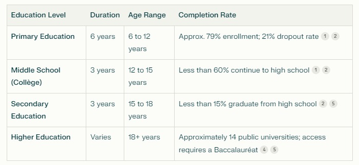
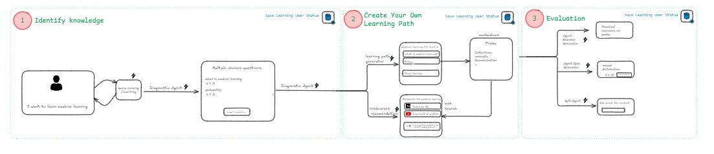

<div align="center">
  
# AIdirassa Online Platform


</div>

## Project Overview

The AIdirassa Online platform is a multi-agent powered platform designed to create a fully AI-generated learning pathway. This includes assessments, course pathways, topics, exercises, quizzes, and more. The platform leverages advanced AI agents to provide a personalized and dynamic learning experience.

## Abstract

### Background and Problem Statement
Morocco's education system faces many challenges that hinder its effectiveness and accessibility.
Despite significant government investment, poor infrastructure, teacher shortages, outdated curricula, and socio-economic disparities persist.



### Impact and Proposed Solution
The AIdirassa Online platform aims to revolutionize the educational experience by using AI agents to generate personalized learning content. This approach saves time and ensures that each student receives a tailored learning experience that adapts to their progress and needs.

### Project Outcomes and Deliverables
- A fully functional AI-powered learning platform.
- Dynamic generation of learning content including assessments, course pathways, topics, exercises, and quizzes.
- RESTful API endpoints for data management and user interactions.
- Integration of AI models for content generation.
- Efficient database management for user data and progress tracking.

## Workflow



**1. Identify Knowledge**
- **Goal**: Assess the user's current understanding of selecting concepts.
- **Process**:
  - The user expresses interest in X concept.
  - A **Diagnostic Agent** engages with the user by asking multiple-choice questions covering foundational topics such as:
    - What is machine learning?
    - Probability concepts.
  - The diagnostic results help identify the user's knowledge gaps and strengths.
- **Output**: A baseline assessment of the user's current knowledge.

---

**2. Create Your Learning Path**
- **Goal**: Construct a tailored learning path based on the diagnostic results.
- **Process**:
  - The platform suggests a **learning path generator** to create a curriculum suitable for the user, offering options like:
    - Basic Introduction to Machine Learning.
    - Focused learning on specific domains like deep learning or probabilistic models.
  - Recommendations for resources include:
    - Tutorials or academic papers.
    - Online videos (e.g., YouTube).
    - External references through web searches.
  - Users can customize their path based on these suggestions.
- **Output**: A personalized learning plan tailored to the user's needs and goals.

---

**3. Evaluation**
- **Goal**: Evaluate the user's progress and mastery of concepts.
- **Process**:
  - Users complete practical **exercises** or **quizzes** designed to test their understanding.
  - The **Agent Quiz Generator** provides dynamic questions for evaluation.
  - Feedback loops help users revisit weak areas if necessary.
- **Output**: Finalized evaluations and progress reports summarizing the user's achievements and next steps.


## Additional Features
- **Save Learning User Status**: Throughout the process, the user's learning status and progress are saved, ensuring continuity in the learning journey.
- **Flexibility**: The system adapts to user needs at every stage by dynamically generating paths and questions.

## Frontend

The frontend of the AIdirassa Online platform is designed to provide an intuitive and engaging user interface. Key features include:

### Technologies Used


## Backend
The backend of the AIdirassa Online platform handles data processing, AI model integration, and user management. Key components include:

- **API Endpoints:** RESTful APIs to serve data to the frontend and manage user interactions.
- **AI Model Integration:** Integration of trained AI models to generate and update learning content dynamically.
- **Database Management:** Efficient storage and retrieval of user data, learning content, and progress tracking.

### Technologies Used


## Demo Video

Check out our demo video  to see the AIdirassa Online platform in action. The video showcases the user interface, interactive learning modules, and the dynamic content generation powered by AI agents.

[[Watch the demo]](https://drive.google.com/file/d/1ex9dpK6kq2eawZvtmPb8w26dfMjF9-1J/view)

## Getting Started

### Folder structure

```markdown
D:.
|   .env
|   .gitignore
|   README.md
|
+---Backend
|   |   main.py
|   |   requirements.txt
|   |
|   +---agents
|   |   |   agent_chek_relevence.py 
|   |   |   exercice_agent.py       
|   |   |   learning_path_agent.py  
|   |   |   qa_topic_agent.py       
|   |   |   quiz_agent.py
|   |   |   resource_recommendation_agent.py
|   |   |   skills_assessement_evaluator_agent.py
|   |   |   skills_assessment_agent.py
|   |   |   topic_content_agent.py
|   |   |
|   +---entities
|   |   |   exercice_agent_entities.py
|   |   |   learning_path_entities.py
|   |   |   qa_entities.py
|   |   |   quiz_entities.py        
|   |   |   skills_entities.py      
|   |   |   skills_evaluator_entities.py
|   |   |   topic_content_entities.py
|   |   |
|   |
|   +---utils
|   |   |   check_model_status.py   
|   |   |   quiz_correction_utils.py|   |   |
|  
+---Frontend
|   |   contact.html
|   |   evaluation.html
|   |   exercises.html
|   |   faqs.html
|   |   final_quiz.html
|   |   index.html
|   |   learning_path.html
|   |   preview.html
|   |
|   +---assets
|   |   +---css
|   |   |       styles.css
|   |   |
|   |   +---js
|   |   |       main.js
|   |   |
|   |   \---media
|   |           contact.svg
|   |           faqs.svg
|   |           logo.png
|   |           morocco.jpg
|   |           morocco1.jpg        
|   |           morocco2.jpg        
|   |           moroccoreversed.jpg
|   |           preloader.gif
|   |           twitermorocco.jpg
|   |
|   \---data
|           modules_data.json
|           quiz_data.json
|           section_data.json
|
\---Notebooks
        Agents_Workflow.ipynb
```

To get started with the AIdirassa Online platform, follow these steps:

1. **Clone the Repository:**
```bash
git clone https://github.com/Elma-dev/aldirassa_online_backend_project.git
```

2. **Navigate to the Project Directory:**
```bash
cd aldirassa_online_backend_project/Backend
```
3. **Create a .env File:**
```bash
touch .env
```
Add the following content to the `.env` file:
```
OPENAI_API_KEY=""
BRAVE_API=""
```

3. **Install the Required Dependencies:**
```bash
pip install -r requirements.txt
```

4. **Run the Application:**
```bash
uvicorn main:app --reload
```

5. **Access the Platform:**
Open your web browser and go to [http://localhost:8000](http://localhost:8000) to access the home page (index.html).

if you face any difficulties please get in touch with one of us :

[Oussama Qouti](https://www.linkedin.com/in/oussama-qouti-105bb820a/)

[Abdeljalil EL MAJJODI](https://www.linkedin.com/in/abdeljalil-el-majjodi/)

[Mahmoud Bidry ](https://www.linkedin.com/in/mahmoudbidry/)

[Azedin Sahir](https://www.linkedin.com/in/azeddin-sahir/)
